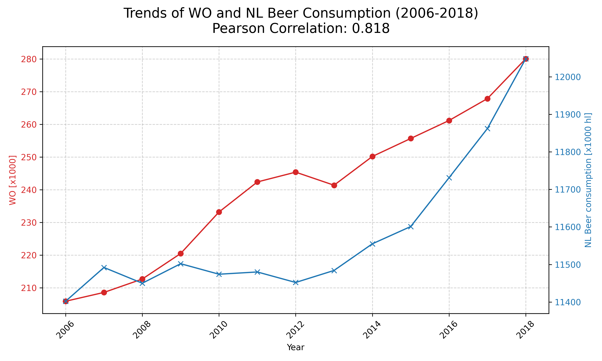

StudentID: 16336631
The title of the following papers pivotal to our knowledge:
  - MCC Van Dyke et al., 2019
    "The Rise of Coccidioides: Forces Against the Dust Devil Unleashed"
  - JT Harvey, Applied Ergonomics, 2002
    "Effect of a nurse back injury prevention intervention on the rate of injury compensation claims"
  - DW Ziegler et al., 2005
    "Correlation of continuous cardiac output measured by a pulmonary artery catheter versus impedance cardiography in ventilated patients"

Plot:

Description of plot:
* **Plot Type:** A **dual-axis line plot** was used to show the trends of the two variables over the years 2006–2018.
* **WO Trend:** The **WO [x1000]** variable (red line) shows a **strong, consistent, and nearly linear increase** throughout the period.
* **Beer Consumption Trend:** **NL Beer consumption** (blue line) also shows an **overall increase**, but the growth is much **slower** and less linear than the WO trend.
* **Correlation:** The data exhibits a **strong positive correlation**, quantified by the Pearson coefficient: **$\rho \approx 0.818$**.
* **Key Takeaway:** The strong correlation means the two quantities tend to rise together. However, it is crucial to remember that this **does not prove causation**
